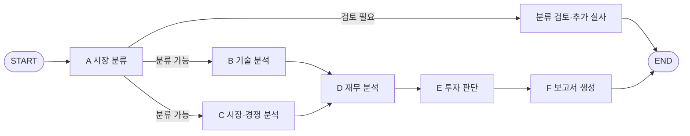

# AI Startup Investment Evaluation Agent

Physical AI·로보틱스 스타트업의 공개 근거를 모아 기술, 시장·경쟁, 재무를 분석하고 투자 의견 보고서를 작성하는 로컬 Agentic RAG 프로젝트입니다.

> 발표 기준: 2026-09-30 `main` (`673ccb7`). 이 문서는 [실습 안내](https://actually-war-1ea.notion.site/AI-1cf7f4c86693800e9e11fa490ed1a2ff)의 README 발표 형식에 맞춰 현재 저장소의 구현을 요약합니다.

## Overview

- **Objective:** Physical AI 기업의 투자 가능성을 기술력, 시장성, 경쟁력, 재무 건전성, 근거 수준으로 평가합니다.
- **Method:** LangGraph로 역할별 에이전트를 연결하고, 검색 근거의 출처·시점·불확실성을 구조화해 다음 단계로 전달합니다.
- **핵심 원칙:** 자료가 없거나 분류가 불명확하면 점수를 채워 넣지 않고 `추가 실사`로 보냅니다.

## Features

- 기업 마스터 또는 새로 전달받은 자료로 로봇 형태를 분류합니다. 신규 분류는 확정 결과가 아닌 검토 대상입니다.
- Markdown·PDF·JSON·JSONL 자료를 읽고 청크로 나눠 로컬 FAISS 인덱스와 SQLite 메타데이터를 만들 수 있습니다.
- 기술 분석은 기업·기준일·자료 등급을 고려해 근거를 찾고 지지·반대·미확인 정보를 구분합니다.
- 시장·경쟁 분석은 산업 공통 자료와 해당 기업 자료를 분리해 로컬 BM25로 검색하고, 모델을 연결한 경우 인용 구절을 검증합니다.
- 투자 판단은 여섯 항목의 점수와 인용 ID를 확인하며, 근거 등급에 따라 허용 점수의 상한을 둡니다.
- 보고서는 `SUMMARY`에서 시작해 `REFERENCE`로 끝납니다. 근거가 없는 문장은 재작성하거나 제외하고 미확인 항목을 표시합니다.

## Tech Stack

| 구분 | 현재 코드 |
| --- | --- |
| Framework | Python 3.11+, LangGraph, Pydantic v2 |
| Embedding | 오픈소스 `Qwen/Qwen3-Embedding-0.6B`, 1024차원; 로컬 실행으로 호출 비용을 줄이도록 설계 |
| Retrieval | 기술 자료: FAISS + SQLite 메타데이터 / 시장 자료: 로컬 BM25 |
| LLM/Generator | 호출자가 모델을 주입. 시장 분석은 선택적 LangChain 구조화 출력, 보고서 예시는 `ScriptedLLM`; `--real`은 별도 설정한 `gpt-4o-mini` 사용 |
| 저장·산출물 | 버전별 FAISS 인덱스, SQLite 메타데이터, Markdown 보고서; PDF 변환은 선택 기능 |

**검색 품질 수치:** Hit Rate@K·MRR의 실측치는 현재 저장소에 없습니다. 기술 분석의 Context Precision·Faithfulness 계산 경로는 평가 함수를 주입할 때 사용합니다. 모델 선택은 로컬 실행과 비용을 고려한 구현 선택이며, 다른 임베딩 모델보다 우수하다는 비교 결과는 아닙니다.

## Agents

| 단계 | 역할 | 현재 구현의 범위 |
| --- | --- | --- |
| A · 시장 분류 | 기업 식별, Physical AI 형태 분류 | 등록 기업 조회 또는 신규 근거의 규칙 기반 분류. 불확실하면 검토 요청 |
| B · 기술 분석 | 제품·논문·특허·팀 근거 정리 | 사전 구축 FAISS/JSONL 검색기와 평가 함수를 주입해 사용 |
| C · 시장·경쟁 분석 | 시장 자료와 기업 자료 검색·비교 | BM25 검색 기본 제공. 생성 모델 미설정 시 검색 근거만 반환 |
| D · 재무 분석 | DART·FSC·KIND 자료 수집·정규화 | 독립 실행 모듈과 mock/live 모드 제공. 메인 그래프 계약에 맞춘 어댑터 연결은 별도 필요 |
| E · 투자 판단 | 근거를 검증한 가중 점수와 판정 | 채점 함수를 주입. 재무자료가 없으면 채점 없이 `추가 실사` |
| F · 보고서 생성 | 근거 인용 보고서 작성 | 구조화 생성과 인용 검사. 예시 스크립트는 준비된 입력·가상 출처 사용 |

### 에이전트를 여섯 개로 나눈 이유

기업 선별 → 기술·시장 실사 → 재무 실사 → 투자 판단 → 보고서 작성이라는 심사 흐름을 역할별 책임으로 옮겼습니다. 자료의 성격에 따라 검증 방법도 다릅니다.

| 역할 | 자료와 처리 방식 | 분리한 이유 |
| --- | --- | --- |
| A | 기업 마스터·신규 자료로 형태 분류 | 로봇 형태에 따라 B가 확인할 지표가 달라짐 |
| B | 논문·특허·제품 설명을 FAISS 벡터 검색 | 표현이 달라도 의미가 가까운 기술 근거를 찾음 |
| C | 시장·경쟁 자료를 BM25 키워드 검색 | 기업명·시장 용어·수치가 들어 있는 자료를 찾음 |
| D | DART·FSC·KIND API 자료 수집 | 재무 수치의 원천과 기준일을 구조화해 보존 |
| E | 근거 ID·등급과 가중 점수 규칙 검사 | 생성 모델의 자유로운 결론 대신 판정 근거를 검증 |
| F | 검증된 근거를 인용하는 보고서 작성 | 분석과 문장 생성의 책임을 분리 |

A를 먼저 실행하는 이유는 휴머노이드에는 자유도·보행 검증, 고정형 매니퓰레이터에는 가반하중·반복정밀도처럼 확인할 기술 지표가 다르기 때문입니다. B와 C는 서로 다른 자료를 독립적으로 분석할 수 있어 병렬로 실행합니다. 단계별 출력과 근거 ID를 분리하면 어느 단계의 검색·해석·판정이 잘못됐는지 추적할 수 있습니다.

### RAG 평가 설계

검색이 관련 자료를 찾았는지와 생성된 기술 분석이 자료에 근거하는지를 별도로 확인합니다. 기술 에이전트 B에는 아래 두 지표의 **계산 경로**가 구현되어 있습니다. 두 평가 함수인 `judge_context`와 `judge_claims`를 함께 주입할 때만 실행되며, 저장소에는 실제 기업 자료로 측정한 점수가 없습니다.

| 지표 | 확인하는 질문 | 코드에서 계산하는 방법 |
| --- | --- | --- |
| Context Precision | 관련 청크가 검색 결과 앞쪽에 있는가? | 평가 함수가 순위별 청크의 관련성을 `true/false`로 판정하고, 관련 청크가 나타난 순위의 정밀도를 평균. `support`·`contradict`·`unknown` 목록을 따로 계산한 뒤 평균 |
| Faithfulness | 기술 분석의 주장이 선택된 근거로 뒷받침되는가? | 평가 함수가 주장별 근거 여부를 판정하고 `근거 있는 주장 수 / 평가한 주장 수`로 계산. 미래 목표를 뜻하는 E등급 자료는 현재 기술 주장의 근거에서 제외 |

B는 지지 근거 최대 3개, 제한·반대 근거 최대 2개, 미확인 근거 최대 1개를 각각 검색합니다. 따라서 Context Precision은 전체 검색 결과뿐 아니라 어떤 입장의 검색이 흔들리는지도 보여 줄 수 있습니다. Faithfulness는 근거가 없는 기술 주장이 분석문에 들어갔는지 점검합니다. 두 지표 모두 평가 함수의 판정 품질에 영향을 받으므로, 실제 사용 시에는 판정 함수 연결과 사람의 표본 검토가 필요합니다.

**미측정 지표:** Hit Rate@K·MRR·Recall@K·NDCG는 정답 문서 목록을 만든 뒤 검색 순위를 비교해야 하므로 현재 측정하지 않았습니다. 정답 답변이 필요한 Answer Correctness류 지표도 적용하지 않았습니다. BLEU·ROUGE 같은 단어 겹침 지표는 근거의 사실관계를 직접 확인하지 않으므로 투자 근거 검증의 우선 지표로 두지 않았습니다. 대표 질문과 정답 문서를 모아 검색 품질을 재는 일은 후속 과제입니다.

## Architecture



| State 영역 | 전달 내용 |
| --- | --- |
| 입력 | `query`, `as_of_date`, `candidate_companies`, `current_index` |
| 분류 | `current_company`, `company_profile`, `market_category` |
| 분석 | `tech_analysis`, `market_analysis`, `competitor_analysis`, `financial_analysis` |
| 근거·결과 | `evidence`, `scores`, `decision`, `report` |

B와 C는 같은 단계에서 병렬로 실행됩니다. `evidence`는 ID를 기준으로 합쳐 중복을 막고, 두 분석이 끝난 뒤 D로 진행합니다. `review_required`이거나 형태가 미확정이면 B~F를 호출하지 않는 검토 분기가 있습니다.

## Investment Criteria

| 등급 | 자료 유형 | 판단에 반영한 방식 |
| --- | --- | --- |
| A | 특허공보, 학술논문, 정부·공공기관 자료, 거래소 공시 | 기술·권리·산업현황을 입증하는 핵심자료 |
| B | 고객사 발표, 투자사 발표, 학회 결과, 공개 저장소와 개발자 문서 | 제품 구현·거래·재현 가능성을 입증 |
| C | 회사 홈페이지, 회사 보도자료, 인터뷰 | 사실관계 확인에 사용하되 독립 검증 필요 |
| D | 언론 기사, 시장 전망, 데모 영상 | 방향성과 정황 확인용 |
| E | 회사의 미래 목표, 출시예정 사양 | 현재 기술평가에서는 원칙적으로 제외 |

| evidence 상태 | 최고 점수 |
|---|---:|
| 지지 근거 없음 | 1점 |
| D등급 지지 근거만 있음 | 2점 |
| A·B·C등급 근거 있음 | 3점 |
| 회사의 정량 근거 + 별도 외부 검증 | 4점 |
| 독립적인 A·B등급 정량 근거 | 5점 |

| 항목 | 가중치 |
| --- | ---: |
| 창업팀 역량·시장 적합성 | 15% |
| 시장 매력도 | 15% |
| 제품·기술 경쟁력 | 25% |
| 시장 검증·사업 성과 | 20% |
| 지속 가능한 경쟁우위 | 10% |
| 확장성·제품당 수익성 | 15% |

E는 항목별 1~5점 제안을 근거 ID·등급과 대조합니다. 재무자료 미확보 또는 근거 부족은 `추가 실사`가 될 수 있습니다. 모든 항목이 기준을 넘고 총점 75점 이상이면 `투자`, 기술을 포함한 다섯 항목 이상이 기준을 넘으면 `조건부 투자`, 그 밖에는 규칙에 따라 `투자 제외`로 판정합니다.

## Directory Structure

```text
src/skala_rag/
├── agents/market_classification/   # A: 기업 분류
├── agents/tech_agents/             # B: 기술 근거 분석
├── agents/market_competition/      # C: 시장·경쟁 검색과 분석
├── agents/financial_agent/         # D: 재무 API 수집·정규화
├── agents/decision_agents/         # E: 투자 판단
├── agents/report.py                # F: 보고서 생성
├── graph/                           # LangGraph와 공유 State
├── ingestion/                       # 문서 로딩·청킹·임베딩·색인
├── retrieval/                       # FAISS 검색·메타데이터
└── cli.py                           # 로컬 인덱스 build/search CLI
scripts/example_robros.py           # 준비된 예시 입력으로 보고서 생성
tests/                              # 단위·통합 테스트
```

## Usage

```bash
uv sync --group dev

# 준비된 로브로스 예시 입력으로 Markdown 보고서 생성(API 키 불필요)
uv run python scripts/example_robros.py --no-pdf

# 색인 CLI: 실제 자료 디렉터리와 로컬 모델 다운로드 필요
uv run skala-rag index build --source ../자료조사 --output storage/indexes/demo-v1
uv run skala-rag index search --index storage/indexes/demo-v1 --query "로봇 기술 근거" --company-id robros
```

예시 보고서 경로는 `storage/reports/robros_2026-09-30.md`입니다. `../자료조사`의 기업 마스터·원문 자료는 저장소 바깥에 있으므로 별도 준비가 필요합니다. 현재 CLI에는 전체 투자 그래프를 한 번에 실행하는 `analyze` 명령이 없습니다.

## Investment Report: 발표 핵심

보고서는 `SUMMARY` → 기업·기술 → 시장·경쟁 → 재무·위험 → 투자 의견 → `REFERENCE` 순으로 읽습니다. 데모의 **64점·조건부 투자**는 `example_robros.py`에 미리 넣은 예시 점수와 가상 URL을 사용한 출력이며, 실제 로브로스에 대한 검증된 투자 의견이 아닙니다. 데모에서는 재구매·현장 가동률·장기 운전 지표를 추가 실사 조건으로 제시합니다.

## Limitations & Lessons Learned

- 분류 A는 키워드 규칙 기반이며 URL 원문·법인 소유권을 자동 검증하지 않습니다.
- C는 기본 실행 시 `retrieval_only`입니다. 원격 LLM의 실제 품질과 검색 Hit Rate@K·MRR은 아직 측정하지 않았습니다.
- D의 독립 출력과 그래프의 `FinancialAssessment` 계약은 추가 연결이 필요합니다. 로브로스 데모도 A~E 전체 실행 결과가 아니라 F에 준비된 입력을 넣은 결과입니다.
- 현재 `main`에서는 일부 테스트가 실패하며, 전체 그래프의 통합 실행을 검증하지 못했습니다.
- 부족한 데이터에서 수치와 결론을 만드는 대신 출처, 기준일, 미확인 항목을 끝까지 보존하는 것이 이 프로젝트의 핵심 학습입니다.

## Contributors

| 이름 | 담당 영역 |
| --- | --- |
| 김지훈 | LangGraph, VectorDB |
| 박시현 | 투자보고서 생성 Agent |
| 이병길 | 재무 정보 수집 Agent |
| 이수빈 | 설계 |
| 최병준 | Tech Agent, Decision Agent |
| 최유정 | 접수/분류 Agent, 시장/경쟁 Agent |
