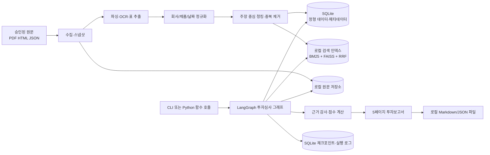
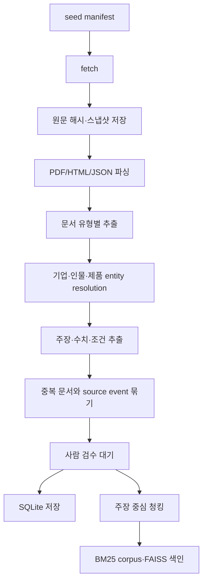
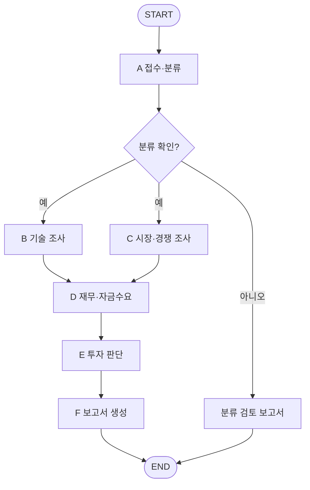

# SKALA RAG Pipeline 구현 설계

## 1. 결론

이 프로젝트는 범용 기업 검색 챗봇보다 **사전에 선정한 Physical AI 스타트업의 투자 검토를 재현 가능한 근거와 함께 수행하는 실사형 RAG 시스템**으로 구현한다.

핵심 설계는 다음과 같다.

- 원문 전체를 무차별 임베딩하지 않고, 회사별 12~20개 산출물과 40~80개의 주장 중심 청크를 관리한다.
- 서술형 근거는 로컬 BM25 + FAISS 하이브리드 검색으로, 숫자·날짜·회사·제품 버전·재무정보는 SQLite로 조회한다.
- LangGraph에서 접수·분류, 기술, 시장·경쟁, 재무, 투자판단, 보고서 에이전트를 명시적으로 분리한다.
- 검색 결과는 지지 근거, 반대 근거, 미확인 항목을 함께 반환한다.
- 최종 답변의 모든 중요한 주장과 수치는 evidence ID에 연결하고, 자료 부족은 추정하지 않고 `확인 불가`로 남긴다.
- 최종 산출물은 5페이지 이내의 투자보고서와, 각 판단을 원문까지 추적할 수 있는 주장-근거 매핑이다.

## 2. 목표와 MVP 범위

### 목표

사용자가 미리 등록된 스타트업을 선택하거나 비교 요청을 입력하면, 시스템이 기준일 시점의 기술력·시장성·경쟁력·재무 및 자금수요를 분석하고 아래 네 가지 중 하나의 투자 의견을 생성한다.

- 투자
- 조건부 투자
- 추가 실사
- 투자 제외

### MVP에 포함

- 보고서에 정의된 사전 선정 기업 10개(로브로스, 위로보틱스, 메타파머스, 에이딘로보틱스, 투모로로보틱스, 뉴빌리티, 라이온로보틱스, 디든로보틱스, 홀리데이로보틱스, 리얼월드)
- 기업당 핵심 산출물 12~20개, 검색 청크 40~80개
- PDF, HTML, 논문, 특허, 공시·IR 자료 수집
- 기업 식별 및 Physical AI 유형 분류
- 기술, 시장·경쟁, 재무 분석
- 주장-근거-반대근거-미확인 항목 연결
- 5페이지 이내 Markdown 보고서 생성
- 보고서와 실행 로그 재현
- Context Precision과 Faithfulness 평가

### MVP에서 제외

- 임의 기업명을 입력하면 인터넷 전체에서 자동 실사 대상을 발굴하는 기능
- 투자 주문이나 외부 시스템의 자동 의사결정
- 유료 리포트 전문의 무단 저장·재배포
- 완전 자동 크롤링 결과를 사람 검수 없이 운영 DB에 승격하는 기능
- 그래프 DB와 외부 DB 서버 도입. 관계는 MVP에서 SQLite 테이블로 표현한다.

## 3. 전체 아키텍처



### 권장 기술 스택

| 영역 | 선택 | 이유 |
|---|---|---|
| 실행 방식 | Python CLI + import 가능한 service 함수 | 서버나 배포 없이 터미널·노트북·테스트에서 동일 로직 재사용 |
| 데이터 모델 | Pydantic v2 | 에이전트 경계의 구조화 입출력과 검증 |
| 워크플로 | LangGraph | 상태, 분기, 루프, 병렬 fan-out/fan-in을 코드로 명시 |
| 정형 저장 | SQLite | 별도 DB 서버 없이 재무 수치, 날짜, 점수, 버전, 실행 로그 저장 |
| 키워드 검색 | `bm25s` 또는 `rank-bm25` | 로컬 Python에서 회사명·모델명·특허번호 정확 검색 |
| 벡터 검색 | FAISS | 단일 PC에서 빠른 벡터 검색과 파일 기반 인덱스 저장 |
| 검색 결합 | Python RRF 구현 | BM25와 vector 순위를 외부 검색 서버 없이 결합 |
| 임베딩 | Qwen3-Embedding-0.6B 우선 검증 | 한·영 혼합 자료와 자체 호스팅 요구에 적합한 후보. 실제 채택은 고정 평가셋으로 확정 |
| 원문 저장 | 프로젝트의 `storage/raw/` | 원본 해시와 스냅샷을 로컬에서 보존 |
| 체크포인트 | SQLite checkpointer | 중단 후 재실행과 실행 추적을 별도 서버 없이 지원 |
| 관측성 | Python 구조화 로그 | 노드별 지연, 검색 문서, 오류를 로컬 JSONL로 기록 |
| 패키지 | `uv` | 참고 프로젝트와 동일한 Python 3.11 기반 재현성 |

배포용 웹 서버, REST API, Docker Compose, PostgreSQL, OpenSearch는 MVP 범위에서 제외한다. 메타데이터 필터는 SQLite 조회와 Python predicate로 적용하고, 데이터 규모가 단일 PC 범위를 벗어날 때만 외부 저장소 전환을 다시 검토한다.

## 4. 데이터 설계

### 저장 계층

1. **원문 저장소**: PDF/HTML/JSON 원본, 접근일, 콘텐츠 해시
2. **SQLite**: 기업·제품·문서·주장·수치·평가·실행 상태
3. **로컬 검색 인덱스**: BM25 corpus와 FAISS vector index

### 핵심 테이블

| 테이블 | 핵심 필드 | 역할 |
|---|---|---|
| `companies` | `id`, `canonical_name`, `legal_name`, `aliases`, `founded_at`, `official_domains`, `as_of_date` | 동명이인·브랜드·법인 식별 |
| `company_people` | `company_id`, `person_id`, `role`, `effective_from/to` | 창업자·핵심 연구자 이력 |
| `products` | `company_id`, `name`, `version`, `released_at`, `status`, `as_of_date` | 제품 버전별 사실 관리 |
| `source_documents` | `id`, `company_id`, `source_type`, `source_grade`, `title`, `uri`, `published_at`, `observed_at`, `content_hash`, `license_status`, `storage_uri` | 원문과 provenance |
| `source_events` | `id`, `primary_document_id`, `event_type`, `event_date` | 재배포 기사·보도자료의 독립 증거 과대계상 방지 |
| `evidence_claims` | `id`, `document_id`, `company_id`, `product_id`, `claim_type`, `claim_text`, `stance`, `quote`, `locator`, `confidence`, `human_reviewed` | 검증 가능한 주장 단위 |
| `numeric_facts` | `claim_id`, `metric_name`, `value`, `unit`, `currency`, `period_start/end`, `test_condition`, `baseline` | 숫자 비교·계산용 정형 데이터 |
| `document_chunks` | `id`, `document_id`, `claim_ids`, `chunk_text`, `token_count`, `embedding_model`, `index_version` | BM25·FAISS 인덱스와 원문 연결 |
| `contradictions` | `left_claim_id`, `right_claim_id`, `type`, `resolution_status`, `note` | 사양·날짜·금액 불일치 관리 |
| `evaluations` | `company_id`, `run_id`, `dimension`, `score`, `weight`, `confidence`, `rationale` | 투자 판단 점수와 근거 |
| `reports` | `run_id`, `company_id`, `decision`, `content`, `generated_at`, `as_of_date` | 최종 산출물 |
| `graph_runs` | `run_id`, `thread_id`, `status`, `model_config`, `index_version`, `started_at`, `completed_at` | 재현성과 운영 추적 |

### evidence 메타데이터

```python
class Evidence(BaseModel):
    evidence_id: str
    company_id: str
    product_id: str | None
    claim_type: str
    claim_text: str
    stance: Literal["support", "contradict", "unknown"]
    source_type: Literal[
        "regulatory", "academic", "patent", "counterparty",
        "first_party", "independent_media", "market_research"
    ]
    source_grade: Literal["A", "B", "C", "D", "E"]
    source_uri: str
    source_title: str
    locator: str | None
    published_at: date | None
    observed_at: date
    effective_from: date | None
    effective_until: date | None
    product_version: str | None
    source_reliability: int       # 1..5
    evidence_directness: int      # 1..5
    claim_specificity: int        # 1..5
    independent_verification: bool
    extraction_confidence: float  # 0..1
    human_reviewed: bool
```

중요한 원칙은 `source_reliability`와 `independent_verification`을 합치지 않는 것이다. 회사 공식 문서는 회사의 현재 주장 확인에는 신뢰할 수 있지만, 그 주장에 대한 독립 검증은 아니다.

### 출처 등급

| 등급 | 자료 | 사용 방식 |
|---|---|---|
| A | 공시, 정부·공공기관, 특허공보, 동료평가 논문 | 기술·권리·재무·산업현황 핵심 근거 |
| B | 고객·투자사 발표, 학회 결과, 개발자 문서, 공개 저장소 | 구현·거래·재현 가능성 근거 |
| C | 회사 홈페이지, 보도자료, 인터뷰 | 사실관계 확인. 독립 검증 필요 |
| D | 일반 언론, 시장 전망, 데모 영상 | 방향과 정황 보조 |
| E | 미래 목표, 출시 예정 사양 | 현재 점수에서 원칙적으로 제외 |

## 5. 수집·색인 파이프라인



### 입력 manifest

자동 웹 크롤링보다 먼저 회사별 승인 소스를 명시한다.

```yaml
company: robros
as_of_date: 2026-09-30
sources:
  - uri: https://example.com/product
    type: first_party
    expected_artifact: product_fact_sheet
  - uri: ./sources/papers/example.pdf
    type: academic
    expected_artifact: paper_evidence_card
```

### 문서 유형별 처리

- PDF: 페이지와 표 위치를 보존하고, 텍스트가 부족하면 OCR 대기열로 보낸다.
- HTML: 본문, 표, 제목, canonical URL, 게시·수정일을 보존한다.
- 공시·외부 공개 데이터: 내려받은 원본 JSON/CSV와 정규화 레코드를 둘 다 저장한다.
- 논문: 방법론, 실험 조건, baseline, 결과, 한계를 함께 추출한다.
- 특허: 패밀리 기준으로 묶고 독립청구항, 출원인, 발명자, 법적 상태를 저장한다.
- 보도자료·기사: 동일 발표일·숫자·인용문·원출처로 `source_event_id`를 묶는다.

### 청킹 원칙

- 일반 웹: 300~700 token
- 논문 방법론: 500~900 token
- 결과표: 표 전체를 한 청크로 유지
- 특허: 독립청구항 단위
- 계약·투자: 사건 단위
- 제품 사양: 제품·버전 단위

다음 조합은 분리하지 않는다.

- 성능 수치 + 시험 조건
- 개선율 + baseline
- 성공률 + 시도 횟수
- 판매량 + 기준일
- 투자금액 + 라운드·통화
- 가격 + 제품 버전
- 주장 + 출처 유형
- 특허 청구항 + 권리 상태

## 6. 검색 설계

### 검색 흐름

1. 질문에서 `company_id`, 분석 차원, 기준일, 제품 버전, 수치 요구 여부를 추출한다.
2. 정확한 숫자·기간 집계는 SQLite repository로 라우팅한다.
3. 설명·근거·장단점은 로컬 hybrid retriever로 라우팅한다.
4. BM25와 vector 결과를 RRF로 합친다.
5. 회사, 문서 등급, 기준일, 제품 버전, 권한으로 필터링한다.
6. 후보 20개를 가져와 cross-encoder 또는 LLM reranker로 8~12개로 줄인다.
7. 최종 context pack은 지지 3개, 반대 2개, 미확인 1개를 목표로 구성한다.
8. 문서 관련성이 부족하면 질의를 한 번 재작성하고, 그래도 부족하면 `확인 불가`로 종료한다.

### 검색 쿼리 세트

자유 질의 하나로 모든 자료를 찾지 않고 평가 차원별 고정 query template을 사용한다.

- 기술: 제품 사양, 아키텍처, 성능, 시험 조건, 논문, 특허, 안전·인증, 자체개발 범위
- 시장: TAM/SAM/SOM, 성장률, 고객군, 기존 대안, 규제
- 경쟁: 동일 조건 사양, 가격, 성능, 납품, 전환비용, 방어력
- 재무: 투자 라운드, 매출, 영업손익, 현금소진, 런웨이, 추가 조달
- 트랙션: PoC, 유료 계약, 반복 구매, 재계약, 생산량, 가동률
- 반증: 한계, 실패, 미확인, 상충, 미인증, 목표치, 예정

### 증거 점수

LLM이 직접 점수를 발명하지 않도록 정규화된 결정론적 함수로 계산한다.

```text
evidence_score = reliability
               × directness
               × independence
               × freshness
               × specificity
```

각 항목을 0~1로 정규화한다. `E` 등급 자료는 현재 성능 점수에서 제외하고 향후 계획 섹션에만 노출한다. 점수는 증거 우선순위에 사용하며, 최종 투자점수와 혼동하지 않는다.

## 7. 에이전트 책임

| 에이전트 | RAG | 책임 | 구조화 출력 |
|---|---:|---|---|
| 접수·분류 | 아니오 | 등록 기업 식별, Physical AI 유형, 단계, 비상장 여부, 분석 템플릿 선택 | `CompanyProfile` |
| 기술 요약 | 예 | 제품, 기술구조, 논문, 특허, 안전·인증, 장단점, 미확인 항목 | `TechAssessment` |
| 시장·경쟁 | 예 | TAM/SAM/SOM, 고객, 대체재, 경쟁지도, 비교 근거 | `MarketAssessment` |
| 재무·자금수요 | 혼합 | SQLite의 수집 완료 숫자 조회, 현금소진·런웨이·희석 리스크. 자료가 없으면 보류 | `FinancialAssessment` |
| 투자 판단 | 아니오 | 결정론적 가중치와 red flag를 적용하고 근거가 있는 이유만 합성 | `InvestmentDecision` |
| 보고서 생성 | 아니오 | 앞 단계 결과와 raw evidence로 5페이지 보고서 생성 | `InvestmentReport` |

RAG가 필요 없는 에이전트가 검색을 임의로 수행하지 않도록 한다. 투자 판단과 보고서 생성은 upstream evidence ID만 소비해야 한다.

## 8. LangGraph 상태와 흐름

### 상태 스키마

```python
class InvestmentState(TypedDict):
    run_id: str
    thread_id: str
    query: str
    as_of_date: str
    candidate_companies: list[CompanyRef]
    current_index: int
    current_company: CompanyRef | None
    company_profile: CompanyProfile | None

    research_tasks: list[ResearchTask]
    evidence: Annotated[list[Evidence], operator.add]
    retrieval_audits: Annotated[list[RetrievalAudit], operator.add]
    tech_summary: TechAssessment | None
    market_analysis: MarketAssessment | None
    competitor_analysis: CompetitorAssessment | None
    financial_analysis: FinancialAssessment | None

    contradictions: list[Contradiction]
    missing_facts: list[MissingFact]
    scores: dict[str, ScoreDetail]
    decision: InvestmentDecision | None
    decision_reason: str
    conditions: list[str]
    evaluated_companies: Annotated[list[EvaluatedCompany], operator.add]
    remaining_candidates: bool
    report: InvestmentReport | None

    query_rewrite_count: int
    retrieval_retry_count: int
    grounding_retry_count: int
    errors: Annotated[list[NodeError], operator.add]
```

`operator.add` reducer는 병렬 조사 결과를 덮어쓰지 않고 합치는 데 사용한다. 다만 동일 evidence ID는 fan-in 직후 결정론적으로 중복 제거한다. 누적 필드는 후보가 바뀔 때 비우지 않고 모든 레코드에 `company_id`를 넣으며, 판단과 보고서 단계에서 현재 기업 ID로 필터링한다.

### 그래프



현재 구현의 실행 순서는 최초 에이전트 인터페이스에 맞춘 `A → (B ∥ C) → D → E → F`다. D는 B/C 결과를 입력받으므로 병렬 분석이 끝난 후 실행한다. 분류가 불확실하면 분석을 중단하고 검토 보고서를 반환한다. 재무자료가 없으면 E는 점수를 추정하지 않고 `추가 실사`를 반환한다. `--financial-api` 사용 시 DART → FSC → KIND 순서로 조회하고, 기본 실행은 재무 API를 호출하지 않는다. 기준일 이후 재무 수치는 제외한다. 재무 수치의 기준일은 공시 발표일과 다르므로 과거 시점의 공시 가용성까지 보장하지 않는다.

CLI의 반복 `--company` 옵션은 후보마다 새로운 그래프 State로 실행하고 각각의 보고서와 `summary.json`을 저장한다. 현재 그래프 내부의 후보 순환·첫 적격 기업에서 조기 종료는 구현하지 않는다. 기업별 근거는 독립 실행으로 분리된다.

### 구현 규칙

- B와 C만 같은 superstep에서 병렬 실행한다. D는 두 분석이 모두 끝난 뒤 실행한다.
- 라우팅과 출력은 `with_structured_output(PydanticModel)`을 사용한다.
- 문자열 JSON을 직접 파싱하지 않는다.
- 모든 루프는 상태 카운터와 recursion limit를 함께 둔다.
- 검색 실패는 빈 문자열이 아니라 `MissingFact(reason, attempted_queries, sources_checked)`를 반환하고, 사유를 `not_found`, `not_disclosed`, `not_applicable`, `confirmed_absent`, `unknown` 중 하나로 정규화한다.
- 노드 예외는 전체 실행을 즉시 잃지 않도록 typed error로 기록하되, 필수 자료 누락은 투자판단을 `추가 실사`로 제한한다.
- 현재 CLI는 실행별 디렉터리에 JSON/Markdown과 모델·index 버전을 저장한다. SQLite 체크포인터, 검색 RRF, 자동 재시도는 후속 설계 목표이며 현재 CLI에 구현된 기능으로 간주하지 않는다.

## 9. 투자 평가 로직

PDF의 여섯 평가축을 아래와 같이 수치화한다. 가중치는 프로젝트용 제안값이며 평가셋을 만든 뒤 조정한다.

| 평가축 | 가중치 | 핵심 질문 |
|---|---:|---|
| 창업팀 역량·시장 적합성 | 15 | 이 문제를 풀 고유 경험과 HW/SW 실행력이 있는가 |
| 시장 매력도 | 15 | 충분히 크고 성장하며 지금 진입할 이유가 있는가 |
| 제품·기술 경쟁력 | 25 | 실제 환경에서 문제를 해결하며 재현 가능한가 |
| 시장 검증·사업 성과 | 20 | 유료 계약, 반복 구매, 확장 계약이 있는가 |
| 지속 가능한 경쟁우위 | 10 | 특허, 데이터, 제조 노하우, 전환비용이 방어 가능한가 |
| 확장성·제품당 수익성 | 15 | 생산량 증가 시 마진과 서비스 비용이 개선되는가 |

### 근거 등급 기반 채점

각 항목은 1~5점이며 `가중 점수 = 항목 점수 / 5 × 가중치`로 계산한다. 점수 상한은 근거 수준이 결정한다.

| 점수 | 필요한 근거 |
|---:|---|
| 5 | A·B 등급의 제3자 독립 검증 정량 근거 |
| 4 | 회사 공개 정량 근거와 일부 외부 확인 |
| 3 | C 등급 중심의 정성 근거 또는 부분 수치 |
| 2 | 회사 주장만 존재하거나 D 등급 정황만 존재 |
| 1 | 근거가 없거나 반대 근거가 우세 |

E 등급의 미래 목표와 출시 예정 사양은 로드맵에는 표시하지만 현재 점수에는 사용하지 않는다. 동일 보도자료의 재배포 기사는 `source_event_id`가 같으면 독립 증거 한 건으로만 센다.

### 판정 기준

아래 규칙을 위에서부터 적용하고 최초로 일치하는 결과를 채택한다.

1. 재무제표 미확보 → `추가 실사`
2. `not_found` 또는 `not_disclosed`인 평가 항목이 3개 이상 → `추가 실사`
3. 6개 항목 모두 3점 이상이고 총점 75점 이상 → `투자`
4. 5개 이상 항목이 3점 이상이며 제품·기술 경쟁력이 3점 이상 → `조건부 투자`
5. 그 외 → `투자 제외`

### 점수와 confidence 분리

좋은 회사처럼 보이는 정도와 자료가 충분한 정도를 하나의 점수로 합치지 않는다.

- `score`: 확인된 근거가 가리키는 투자 매력도
- `confidence`: 필수 질문 충족률, 독립 검증률, 증거 품질, 상충 미해결률

confidence는 판정 규칙을 대체하지 않는 보조 정보다. 필수 재무자료가 없으면 점수와 confidence를 계산해 투자로 승격하지 않고 항상 `추가 실사`로 제한한다.

## 10. 보고서 설계

최종 보고서는 아래 순서를 고정하고 5페이지 이내로 렌더링한다.

1. **SUMMARY / INVESTMENT SNAPSHOT**
   - 최종 의견, 핵심 투자 논거 최대 3개, 반대 논거 최대 2개
   - 회사, 단계, 희망 투자금, 기준일, 종합점수와 confidence
2. **BUSINESS, PRODUCT & TECHNOLOGY**
   - 고객 문제, 제품, 비즈니스 모델, 핵심 기술, 시험 조건과 기술 한계
3. **MARKET, COMPETITION & TRACTION**
   - TAM/SAM/SOM과 가정, 비교기업 최대 5개, 유료·반복 트랙션
4. **TEAM, FINANCIALS & VALUATION**
   - 핵심팀, 매출·손익·burn·runway, 필요 자금, 가치상승 시나리오
5. **RISK, DECISION & REFERENCE**
   - 핵심 위험 최대 5개, 조건·추가 실사 최대 3개, limitations, 실제 사용 자료

작성 순서는 상세 분석 → 투자 판단 → REFERENCE → SUMMARY다. 각 핵심 문장에는 `[EVD-...]`를 붙이고, 보고서 생성 후 citation checker가 존재 여부와 source locator를 확인한다.

## 11. Python 실행 인터페이스

웹 API 없이 하나의 Python 패키지와 CLI로 실행한다. CLI는 얇은 입출력 계층이며 실제 로직은 `services/`의 Python 함수로 제공해 테스트와 노트북에서도 재사용한다.

| 명령 | 기능 | 주요 출력 |
|---|---|---|
| `uv run skala-rag ingest --manifest configs/companies/robros.yaml` | 승인 문서 파싱·증거 추출·로컬 색인 | SQLite DB, BM25 corpus, FAISS index |
| `uv run skala-rag companies` | 등록 기업과 기준일 조회 | 터미널 표 또는 JSON |
| `uv run skala-rag analyze --company robros --as-of 2026-09-30` | 투자 분석 그래프 실행 | `run_id`, 판정, 보고서 경로 |
| `uv run skala-rag evidence EVD-ID` | 증거와 원문 위치 확인 | claim, grade, locator |
| `uv run skala-rag evaluate --dataset evals/questions.jsonl` | 고정 평가셋 실행 | 품질 지표 JSON |

Python 코드에서는 다음처럼 동일한 service를 직접 호출한다.

```python
from skala_rag.services.analysis import analyze_company

result = analyze_company(company_id="robros", as_of_date="2026-09-30")
print(result.decision.decision)
print(result.report_path)
```

모든 결과는 `storage/runs/{run_id}/` 아래에 `state.json`, `retrieval.jsonl`, `report.md`로 남긴다. 긴 작업도 별도 job server를 두지 않고 동기 실행하며, 진행 상황은 Python logging으로 표시한다.

## 12. 디렉터리 구조

```text
skala-rag-pipeline/
├── README.md
├── pyproject.toml
├── uv.lock
├── .env.example
├── docs/
│   ├── implementation-design.md
│   ├── data-dictionary.md
│   └── evaluation.md
├── configs/
│   ├── companies/
│   ├── prompts/
│   └── settings.yaml
├── src/skala_rag/
│   ├── cli.py
│   ├── core/
│   ├── services/
│   │   ├── ingestion.py
│   │   ├── analysis.py
│   │   └── evaluation.py
│   ├── ingestion/
│   │   ├── loaders/
│   │   ├── parsers/
│   │   ├── extractors/
│   │   ├── dedup.py
│   │   └── indexer.py
│   ├── retrieval/
│   │   ├── hybrid.py
│   │   ├── sqlite.py
│   │   ├── bm25.py
│   │   ├── vector.py
│   │   ├── reranker.py
│   │   └── context_builder.py
│   ├── agents/
│   │   ├── intake.py
│   │   ├── technology.py
│   │   ├── market.py
│   │   ├── finance.py
│   │   ├── decision.py
│   │   └── report.py
│   ├── graph/
│   │   ├── state.py
│   │   ├── routes.py
│   │   └── workflow.py
│   ├── models/
│   ├── repositories/
│   ├── evaluation/
│   └── security/
├── migrations/            # SQLite schema 버전
├── scripts/
├── tests/
│   ├── unit/
│   ├── integration/
│   ├── graph/
│   └── evaluation/
├── storage/
│   ├── raw/          # git 제외
│   ├── db/            # SQLite 파일
│   ├── indexes/       # BM25·FAISS 인덱스
│   └── runs/          # 실행별 state·log·report
└── evals/
    ├── questions.jsonl
    └── expected_routes.jsonl
```

## 13. 참고 코드에서 가져갈 부분과 수정할 부분

| 참고 코드 | 재사용할 패턴 | 프로젝트에서의 보강 |
|---|---|---|
| `20-RAG/01~04` | retrieve → relevance → rewrite/web fallback | 재시도 1회, typed missing fact, 메타데이터 필터 |
| `20-RAG/10~12` | relevance, groundedness, answer grader | 인용 완전성·숫자 대조·상충 검사 추가 |
| `20-RAG/14` | SQL/vector/both router, read-only SQL guard, retry counter | 허용된 query service만 사용하고 LLM raw SQL 실행 최소화 |
| `12-Pattern/04` | `Send` fan-out/fan-in | 회사별·분석축별 병렬 조사에 적용 |
| `10-Agent/20` | raw finding을 보존한 뒤 analyst/report가 직접 사용 | source URL뿐 아니라 evidence ID와 locator 강제 |
| `10-Agent/11` | 보고서 생성 단계 분리 | 고정 5페이지 schema와 citation checker 적용 |
| `11-Middleware/03` | guardrail, HITL, rate limit | 신규 출처 승인과 최종 투자판단 검수 지점에 적용 |

### 현재 참고 모듈을 그대로 사용하면 안 되는 이유

- `PDFRetrievalChain`은 `source_uri`를 문자열로 받지만 `load_documents`는 리스트를 순회한다. 그대로 실행하면 문자열의 각 문자를 파일 경로로 처리할 수 있다.
- `PDFRetrievalChain.__init__`이 `super().__init__(**kwargs)`를 호출하지만 부모 생성자는 인자를 받지 않는다.
- 확장자 없는 PDF는 PDF가 맞아도 거부한다. MIME type과 magic bytes로 판별해야 한다.
- FAISS 인덱스 파일은 신뢰된 로컬 산출물만 `read_index`로 읽는다.
- `format_docs`는 모든 문서에 `source`, `page`가 있다고 가정한다. 문서 유형별 locator 모델이 필요하다.
- 단순 similarity top-k는 제품명·특허번호·정확한 수치 검색과 반대 증거 균형을 보장하지 않는다.
- notebook 예제의 수동 JSON parsing 대신 Pydantic structured output을 사용해야 한다.
- 메모리 전용 checkpointer는 실행 종료 후 상태가 사라지므로 SQLite checkpointer로 교체한다.
- 숫자가 출처에 존재하는지만 검사하는 grounding은 단위·기간·주어가 바뀐 오류를 잡지 못한다. `numeric_facts`와 claim-level entailment를 함께 검사한다.

## 14. 보안과 안전

- 검색 문서의 지시문은 데이터로만 취급하고 시스템 지시로 실행하지 않는다.
- 수집 URL은 허용 scheme, DNS/IP, 최대 크기, timeout을 검사해 SSRF를 방지한다.
- 원문·인덱스·보고서 권한을 분리하고 유료 자료는 라이선스 상태로 필터링한다.
- LLM이 임의 SQL을 SQLite에 직접 실행하지 않게 한다. MVP는 allowlisted repository 함수만 사용한다.
- Text-to-SQL은 MVP에서 제외한다. 숫자 조회는 타입이 지정된 repository 메서드로만 수행한다.
- PII와 연구자 개인 연락처는 색인 전 제거한다.
- prompt, 모델, 임베딩, index 버전과 입력 evidence ID를 실행 로그에 남긴다.
- 최종 투자 판단은 사람 검수 전까지 `draft` 상태로 표시한다.

## 15. 평가와 테스트

### RAG 평가

- **Context Precision**: 검색·reranker가 유용한 청크를 상위에 배치하는지 평가
- **Faithfulness**: 생성된 주장이 검색 컨텍스트로 뒷받침되는지 평가
- **Citation completeness**: 중요한 주장·수치에 유효 evidence ID가 붙었는지 평가
- **Numeric consistency**: 값·단위·통화·기간·제품 버전이 원문과 일치하는지 평가
- **Contradiction coverage**: 준비된 상충 사례를 보고서가 누락하지 않는지 평가

초기에는 reference-free 두 지표를 주 평가로 사용하고, 30~50개 질문을 사람이 검수해 LLM judge 편향을 확인한다. 이후 질문 50~100개에 정답 문서 하나씩만 지정해 Hit Rate와 MRR을 추가한다.

### 코드 테스트

- 단위: parser, entity resolver, evidence scorer, SQLite repository, decision rules
- 통합: PDF/HTML → SQLite/BM25/FAISS → hybrid retrieval
- 그래프: 각 branch, retry 한도, 일부 에이전트 실패, checkpoint resume
- golden: 고정 회사·기준일에서 동일한 evidence set과 결정 schema 생성
- 보안: prompt injection corpus, 악성 URL, 비허용 파일 경로, 권한 없는 문서 필터

### 완료 기준

- `uv sync` 후 별도 서버 없이 sample 기업을 색인할 수 있다.
- CLI 명령 또는 Python 함수 호출로 실제 투자보고서가 생성된다.
- 모든 핵심 주장과 수치가 evidence ID에서 원문 위치까지 추적된다.
- 재시도 루프가 상한 내 종료되고 실패 원인이 보고서에 표시된다.
- 보고서가 5페이지 구조, 네 가지 투자 의견, REFERENCE 종료 규칙을 지킨다.
- README에 목적, 구조, 환경변수, 실행, 평가 방법이 재현 가능하게 설명된다.

## 16. 구현 순서

### 1단계 - 실행 골격

- `pyproject.toml`, CLI entry point, 로컬 설정 로더
- SQLite schema migration과 저장 경로 초기화
- 공통 Pydantic 모델, repository, structured logging

### 2단계 - 수집과 검색

- PDF/HTML/JSON loader와 원문 스냅샷
- 회사·제품·인물 정규화, claim/numeric fact 추출
- 중복·버전 처리, Qwen 임베딩, BM25 + FAISS hybrid retrieval
- 회사 한 곳의 40~80개 청크 golden dataset 완성

### 3단계 - 그래프와 에이전트

- 접수·분류 → 재무 게이트 → 기술·시장 병렬 조사 순서 구현
- 미리 내려받은 DART → 금융위 → KIND 자료의 필드 단위 순차 보완과 투자정보 RAG 결합
- B·C 병렬 실행, fan-in, relevance/rewrite/missing 분기
- 모순·수치 감사, 점수·confidence, 네 가지 투자판단
- 후보 순회와 후보 소진 종료 경로
- SQLite checkpoint와 실행 상태 파일 저장

### 4단계 - 보고서와 품질

- 고정 5페이지 report schema와 Markdown renderer
- citation/grounding 검사와 1회 수정 루프
- RAGAS 평가, routing 평가, golden regression
- README, sample run, 데모용 보고서

## 17. 첫 구현 단위

첫 수직 슬라이스는 기업 하나와 질문 하나를 끝까지 통과시키는 것이다.

1. 로브로스의 승인 문서 12~20개를 manifest로 등록한다.
2. 원문 → evidence claim → FAISS 인덱스·SQLite 메타데이터 저장을 완성한다.
3. 기술 에이전트 하나만 먼저 구현한다.
4. 근거 ID가 포함된 기술 평가 결과를 만든다.
5. 시장 에이전트를 추가하고 기술·시장 노드를 병렬 연결한다.
6. 원 보고서의 1~5점 채점과 우선순위 판정 규칙을 구현한다.
7. 후보 순회, 5페이지 보고서, 인용 검사를 연결한다.
8. 동일 입력에서 evidence set과 판정이 안정적으로 재현되는지 평가한다.

이 순서가 데이터 파이프라인, 검색 품질, 에이전트 협업, 보고서 재현성을 가장 빠르게 동시에 검증한다.

## 18. 현재 저장소와 목표 설계의 차이

현재 코드는 의존성을 주입한 6개 에이전트와 병렬 evidence 병합을 검증하는 초기 골격이다. 다음 차이를 해소해야 보고서 설계와 일치한다.

| 영역 | 현재 상태 | 목표 상태 |
|---|---|---|
| 실행 순서 | 분류 → 기술·시장 → 재무 → 판단 → 보고서 | 분류 → 재무 → 기술·시장 → 판단 → 보고서 |
| 재무 게이트 | 없음 | 재무제표 미확보 시 기술·시장 생략 후 추가 실사 |
| 후보 처리 | 단일 기업 | `current_index` 기반 사전 후보 순회와 소진 종료 |
| 증거 모델 | 최소 필드 | 회사·수치·조건·기준일·독립성·이벤트·버전 추적 |
| 검색 | 인터페이스만 존재 | 로컬 BM25 + FAISS + RRF, stance별 quota |
| 재무 조회 | 단일 analyzer | 수집 시 DART → 금융위 → KIND 순차 보완, 실행 시 SQLite 조회 + funding RAG |
| 판단 | 외부 callable에 위임 | 6개 평가축, 근거 등급 상한, 우선순위 규칙의 결정론적 계산 |
| 보고서 감사 | 없음 | citation completeness 100%, 숫자·단위·기간 대조 |

따라서 다음 코드 변경의 우선순위는 `FinancialAssessment.status`와 값별 provenance 추가 → `route_after_financial` 구현 → B·C fan-out/fan-in 재배치 → 판정 규칙 함수화 → 후보 루프 추가 순서다.

## 19. 로컬 실행 시퀀스와 완료 조건

### 오프라인 수집·색인

1. 승인된 source manifest를 읽고 원문과 해시를 저장한다.
2. PDF/HTML/JSON을 파싱하고 페이지·표·원문 위치를 보존한다.
3. 회사·제품·버전·기준일을 정규화한다.
4. 검증 가능한 주장과 숫자·시험조건을 추출한다.
5. 동일 source event, 문서 중복, superseded 버전을 표시한다.
6. 사람 검수 후 SQLite, BM25 corpus, FAISS index에 반영한다.
7. 고정 평가셋으로 embedding 및 retrieval 버전을 승인한다.

### 로컬 투자 분석

1. A가 사전 등록 후보와 Physical AI 유형을 조회한다.
2. D가 SQLite의 수집 완료 재무 필드를 조회하고 funding evidence만 RAG로 보완한다.
3. 재무 게이트 통과 시 B와 C가 회사·등급·기준일 필터를 사용해 병렬 검색한다.
4. 검색 결과를 stance별 quota로 구성하고 evidence ID를 부여한다.
5. fan-in 뒤 중복, 모순, 수치·기간·제품 버전을 감사한다.
6. E가 결정론적 점수와 우선순위 규칙으로 판정한다.
7. 적격 기업이면 F가 보고서를 만들고, 아니면 다음 후보로 반복한다.
8. citation checker가 모든 핵심 주장과 수치를 검증한 뒤 최종 보고서를 공개한다.

### MVP 완료 조건

- 재무제표 미확보 기업에서 B·C 호출이 발생하지 않는다.
- B·C 동시 쓰기에도 evidence가 손실되지 않고 중복 ID가 제거된다.
- 모든 수치·핵심 주장에 유효한 evidence ID와 원문 locator가 있다.
- 자료 부재가 5개 상태 중 하나로 표현되고 생성 모델이 값을 추정하지 않는다.
- 판정 규칙의 경계값과 우선순위가 단위 테스트로 고정된다.
- 마지막 후보까지 부적격인 경우에도 유한 시간 안에 요약 보고서로 종료한다.
- 평가 질문 50개에서 Context Precision 0.70 이상, Faithfulness 0.85 이상, 출처 연결률 100%를 달성한다.
