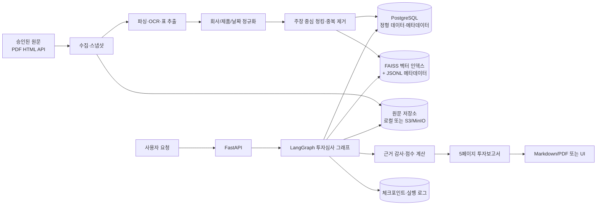
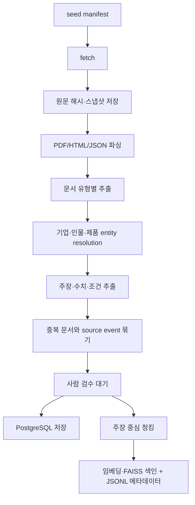
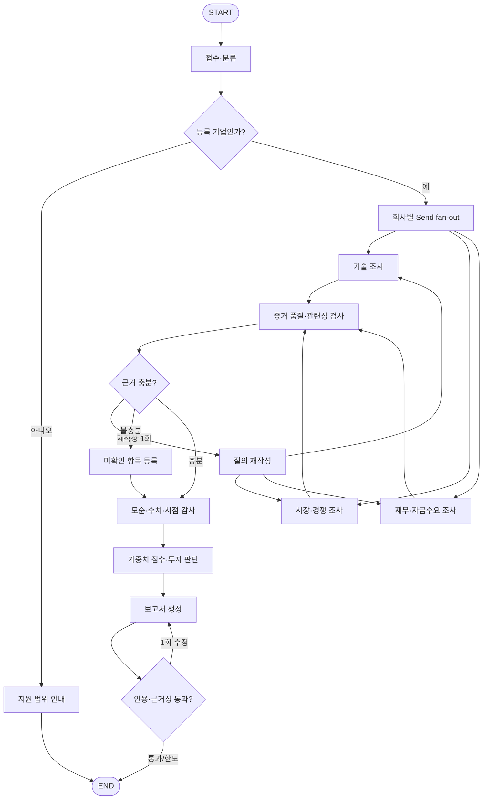

# SKALA RAG Pipeline 구현 설계

## 1. 결론

이 프로젝트는 범용 기업 검색 챗봇보다 **사전에 선정한 Physical AI 스타트업의 투자 검토를 재현 가능한 근거와 함께 수행하는 실사형 RAG 시스템**으로 구현한다.

핵심 설계는 다음과 같다.

- 원문 전체를 무차별 임베딩하지 않고, 회사별 12~20개 산출물과 40~80개의 주장 중심 청크를 관리한다.
- 서술형 근거는 사전 생성한 FAISS 벡터 인덱스에서 검색하고, 숫자·날짜·회사·제품 버전·재무정보는 PostgreSQL에서 조회한다.
- LangGraph에서 접수·분류, 기술, 시장·경쟁, 재무, 투자판단, 보고서 에이전트를 명시적으로 분리한다.
- 검색 결과는 지지 근거, 반대 근거, 미확인 항목을 함께 반환한다.
- 최종 답변의 모든 중요한 주장과 수치는 evidence ID에 연결하고, 자료 부족은 추정하지 않고 `확인 불가`로 남긴다.
- 최종 산출물은 5페이지 이내의 투자보고서와, 각 판단을 원문까지 추적할 수 있는 주장-근거 매핑이다.

## 2. 목표와 MVP 범위

### 목표

사용자가 미리 등록된 스타트업을 선택하거나 비교 요청을 입력하면, 시스템이 기준일 시점의 기술력·시장성·경쟁력·재무 및 자금수요를 분석하고 아래 네 가지 중 하나의 투자 의견을 생성한다.

- 투자
- 조건부 투자
- 추가 실사
- 투자 제외

### MVP에 포함

- 사전 선정 기업 3~5개
- 기업당 핵심 산출물 12~20개, 검색 청크 40~80개
- PDF, HTML, 논문, 특허, 공시·IR 자료 수집
- 기업 식별 및 Physical AI 유형 분류
- 기술, 시장·경쟁, 재무 분석
- 주장-근거-반대근거-미확인 항목 연결
- 5페이지 이내 Markdown 보고서 생성
- 보고서와 실행 로그 재현
- Context Precision과 Faithfulness 평가

### MVP에서 제외

- 임의 기업명을 입력하면 인터넷 전체에서 자동 실사 대상을 발굴하는 기능
- 투자 주문이나 외부 시스템의 자동 의사결정
- 유료 리포트 전문의 무단 저장·재배포
- 완전 자동 크롤링 결과를 사람 검수 없이 운영 DB에 승격하는 기능
- 그래프 DB 도입. 관계는 MVP에서 PostgreSQL 테이블로 표현하고 필요할 때 확장한다.

## 3. 전체 아키텍처



### 권장 기술 스택

| 영역 | 선택 | 이유 |
|---|---|---|
| API | FastAPI + Pydantic v2 | 구조화 입출력, OpenAPI, 비동기 작업 연동 |
| 워크플로 | LangGraph | 상태, 분기, 루프, 병렬 fan-out/fan-in을 코드로 명시 |
| 정형 저장 | PostgreSQL | 재무 수치, 날짜, 점수, 버전, 관계, 감사 로그 |
| 검색 | FAISS | 사전 생성한 벡터 인덱스에서 의미 기반 검색 |
| 메타데이터 필터 | JSONL + Python | 회사·기준일·출처 등은 벡터 ID와 연결된 자료로 확인 |
| 임베딩 | Qwen3-Embedding-0.6B 우선 검증 | 한·영 혼합 자료와 자체 호스팅 요구에 적합한 후보. 실제 채택은 고정 평가셋으로 확정 |
| 원문 저장 | 로컬 파일(MVP), S3/MinIO(확장) | 원본 해시와 스냅샷 보존 |
| 체크포인트 | PostgreSQL checkpointer | 재시작, 실행 추적, 사람 검수 재개 |
| 관측성 | 구조화 로그 + LangSmith 선택 | 노드별 지연, 토큰, 검색 문서, 오류 추적 |
| 패키지 | `uv` | 참고 프로젝트와 동일한 Python 3.11 기반 재현성 |

FAISS 인덱스는 원문이 아니라 벡터를 보관한다. `faiss_id`로 연결되는 JSONL 메타데이터를 함께 관리하고, 사용자 요청 전에 인덱스를 생성·갱신한다. 현 구현은 작은 대상 기업 집합을 전부 검색한 뒤 회사·기준일·입장을 필터링한다.

## 4. 데이터 설계

### 저장 계층

1. **원문 저장소**: PDF/HTML/JSON 원본, 접근일, 콘텐츠 해시
2. **PostgreSQL**: 기업·제품·문서·주장·수치·평가·실행 상태
3. **FAISS + JSONL**: 검색 가능한 evidence 벡터와 ID별 청크·출처 메타데이터

### 핵심 테이블

| 테이블 | 핵심 필드 | 역할 |
|---|---|---|
| `companies` | `id`, `canonical_name`, `legal_name`, `aliases`, `founded_at`, `official_domains`, `as_of_date` | 동명이인·브랜드·법인 식별 |
| `company_people` | `company_id`, `person_id`, `role`, `effective_from/to` | 창업자·핵심 연구자 이력 |
| `products` | `company_id`, `name`, `version`, `released_at`, `status`, `as_of_date` | 제품 버전별 사실 관리 |
| `source_documents` | `id`, `company_id`, `source_type`, `source_grade`, `title`, `uri`, `published_at`, `observed_at`, `content_hash`, `license_status`, `storage_uri` | 원문과 provenance |
| `source_events` | `id`, `primary_document_id`, `event_type`, `event_date` | 재배포 기사·보도자료의 독립 증거 과대계상 방지 |
| `evidence_claims` | `id`, `document_id`, `company_id`, `product_id`, `claim_type`, `claim_text`, `stance`, `quote`, `locator`, `confidence`, `human_reviewed` | 검증 가능한 주장 단위 |
| `numeric_facts` | `claim_id`, `metric_name`, `value`, `unit`, `currency`, `period_start/end`, `test_condition`, `baseline` | 숫자 비교·계산용 정형 데이터 |
| `document_chunks` | `id`, `document_id`, `claim_ids`, `chunk_text`, `token_count`, `embedding_model`, `index_version` | FAISS ID와 원문 연결 |
| `contradictions` | `left_claim_id`, `right_claim_id`, `type`, `resolution_status`, `note` | 사양·날짜·금액 불일치 관리 |
| `evaluations` | `company_id`, `run_id`, `dimension`, `score`, `weight`, `confidence`, `rationale` | 투자 판단 점수와 근거 |
| `reports` | `run_id`, `company_id`, `decision`, `content`, `generated_at`, `as_of_date` | 최종 산출물 |
| `graph_runs` | `run_id`, `thread_id`, `status`, `model_config`, `index_version`, `started_at`, `completed_at` | 재현성과 운영 추적 |

### evidence 메타데이터

```python
class Evidence(BaseModel):
    evidence_id: str
    company_id: str
    product_id: str | None
    claim_type: str
    claim_text: str
    stance: Literal["support", "contradict", "unknown"]
    source_type: Literal[
        "regulatory", "academic", "patent", "counterparty",
        "first_party", "independent_media", "market_research"
    ]
    source_grade: Literal["A", "B", "C", "D", "E"]
    source_uri: str
    source_title: str
    locator: str | None
    published_at: date | None
    observed_at: date
    effective_from: date | None
    effective_until: date | None
    product_version: str | None
    source_reliability: int       # 1..5
    evidence_directness: int      # 1..5
    claim_specificity: int        # 1..5
    independent_verification: bool
    extraction_confidence: float  # 0..1
    human_reviewed: bool
```

중요한 원칙은 `source_reliability`와 `independent_verification`을 합치지 않는 것이다. 회사 공식 문서는 회사의 현재 주장 확인에는 신뢰할 수 있지만, 그 주장에 대한 독립 검증은 아니다.

### 출처 등급

| 등급 | 자료 | 사용 방식 |
|---|---|---|
| A | 공시, 정부·공공기관, 특허공보, 동료평가 논문 | 기술·권리·재무·산업현황 핵심 근거 |
| B | 고객·투자사 발표, 학회 결과, 개발자 문서, 공개 저장소 | 구현·거래·재현 가능성 근거 |
| C | 회사 홈페이지, 보도자료, 인터뷰 | 사실관계 확인. 독립 검증 필요 |
| D | 일반 언론, 시장 전망, 데모 영상 | 방향과 정황 보조 |
| E | 미래 목표, 출시 예정 사양 | 현재 점수에서 원칙적으로 제외 |

## 5. 수집·색인 파이프라인



### 입력 manifest

자동 웹 크롤링보다 먼저 회사별 승인 소스를 명시한다.

```yaml
company: robros
as_of_date: 2026-09-30
sources:
  - uri: https://example.com/product
    type: first_party
    expected_artifact: product_fact_sheet
  - uri: ./sources/papers/example.pdf
    type: academic
    expected_artifact: paper_evidence_card
```

### 문서 유형별 처리

- PDF: 페이지와 표 위치를 보존하고, 텍스트가 부족하면 OCR 대기열로 보낸다.
- HTML: 본문, 표, 제목, canonical URL, 게시·수정일을 보존한다.
- 공시·API: 원본 JSON과 정규화 레코드를 둘 다 저장한다.
- 논문: 방법론, 실험 조건, baseline, 결과, 한계를 함께 추출한다.
- 특허: 패밀리 기준으로 묶고 독립청구항, 출원인, 발명자, 법적 상태를 저장한다.
- 보도자료·기사: 동일 발표일·숫자·인용문·원출처로 `source_event_id`를 묶는다.

### 청킹 원칙

- 일반 웹: 300~700 token
- 논문 방법론: 500~900 token
- 결과표: 표 전체를 한 청크로 유지
- 특허: 독립청구항 단위
- 계약·투자: 사건 단위
- 제품 사양: 제품·버전 단위

다음 조합은 분리하지 않는다.

- 성능 수치 + 시험 조건
- 개선율 + baseline
- 성공률 + 시도 횟수
- 판매량 + 기준일
- 투자금액 + 라운드·통화
- 가격 + 제품 버전
- 주장 + 출처 유형
- 특허 청구항 + 권리 상태

## 6. 검색 설계

### 검색 흐름

1. 질문에서 `company_id`, 분석 차원, 기준일, 제품 버전, 수치 요구 여부를 추출한다.
2. 정확한 숫자·기간 집계는 PostgreSQL로 라우팅한다.
3. 설명·근거·장단점은 FAISS 벡터 검색으로 라우팅한다.
4. FAISS가 반환한 ID 순위와 JSONL 메타데이터를 연결한다.
5. 회사, 문서 등급, 기준일, 제품 버전, 권한을 메타데이터에서 필터링한다.
6. 현재 B는 회사·기준일 필터 후 입장별로 지지 3개, 반대 2개, 미확인 1개까지 선택한다.
7. 필요할 때 후보를 더 가져와 reranker를 연결한다.
8. 문서 관련성이 부족하면 질의를 한 번 재작성하고, 그래도 부족하면 `확인 불가`로 종료한다.

### 검색 쿼리 세트

자유 질의 하나로 모든 자료를 찾지 않고 평가 차원별 고정 query template을 사용한다.

- 기술: 제품 사양, 아키텍처, 성능, 시험 조건, 논문, 특허, 안전·인증, 자체개발 범위
- 시장: TAM/SAM/SOM, 성장률, 고객군, 기존 대안, 규제
- 경쟁: 동일 조건 사양, 가격, 성능, 납품, 전환비용, 방어력
- 재무: 투자 라운드, 매출, 영업손익, 현금소진, 런웨이, 추가 조달
- 트랙션: PoC, 유료 계약, 반복 구매, 재계약, 생산량, 가동률
- 반증: 한계, 실패, 미확인, 상충, 미인증, 목표치, 예정

### 증거 점수

LLM이 직접 점수를 발명하지 않도록 정규화된 결정론적 함수로 계산한다.

```text
evidence_score = reliability
               × directness
               × independence
               × freshness
               × specificity
```

각 항목을 0~1로 정규화한다. `E` 등급 자료는 현재 성능 점수에서 제외하고 향후 계획 섹션에만 노출한다. 점수는 증거 우선순위에 사용하며, 최종 투자점수와 혼동하지 않는다.

## 7. 에이전트 책임

| 에이전트 | RAG | 책임 | 구조화 출력 |
|---|---:|---|---|
| 접수·분류 | 아니오 | 등록 기업 식별, Physical AI 유형, 단계, 비상장 여부, 분석 템플릿 선택 | `CompanyProfile` |
| 기술 요약 | 예 | 제품, 기술구조, 논문, 특허, 안전·인증, 장단점, 미확인 항목 | `TechAssessment` |
| 시장·경쟁 | 예 | TAM/SAM/SOM, 고객, 대체재, 경쟁지도, 비교 근거 | `MarketAssessment` |
| 재무·자금수요 | 혼합 | PostgreSQL/API 숫자 조회, 현금소진·런웨이·희석 리스크. 자료가 없으면 보류 | `FinancialAssessment` |
| 투자 판단 | 아니오 | 결정론적 가중치와 red flag를 적용하고 근거가 있는 이유만 합성 | `InvestmentDecision` |
| 보고서 생성 | 아니오 | 앞 단계 결과와 raw evidence로 5페이지 보고서 생성 | `InvestmentReport` |

RAG가 필요 없는 에이전트가 검색을 임의로 수행하지 않도록 한다. 투자 판단과 보고서 생성은 upstream evidence ID만 소비해야 한다.

## 8. LangGraph 상태와 흐름

### 상태 스키마

```python
class InvestmentState(TypedDict):
    run_id: str
    thread_id: str
    query: str
    as_of_date: str
    candidate_companies: list[CompanyRef]
    current_company: CompanyRef | None
    company_profile: CompanyProfile | None

    research_tasks: list[ResearchTask]
    evidence: Annotated[list[Evidence], operator.add]
    retrieval_audits: Annotated[list[RetrievalAudit], operator.add]
    tech_summary: TechAssessment | None
    market_analysis: MarketAssessment | None
    competitor_analysis: CompetitorAssessment | None
    financial_analysis: FinancialAssessment | None

    contradictions: list[Contradiction]
    missing_facts: list[MissingFact]
    scores: dict[str, ScoreDetail]
    decision: InvestmentDecision | None
    report: InvestmentReport | None

    query_rewrite_count: int
    retrieval_retry_count: int
    grounding_retry_count: int
    errors: Annotated[list[NodeError], operator.add]
```

`operator.add` reducer는 병렬 조사 결과를 덮어쓰지 않고 합치는 데 사용한다. 다만 동일 evidence ID는 fan-in 직후 결정론적으로 중복 제거한다.

### 그래프



### 구현 규칙

- 조사 노드는 `Send`로 병렬 실행한다.
- 라우팅과 출력은 `with_structured_output(PydanticModel)`을 사용한다.
- 문자열 JSON을 직접 파싱하지 않는다.
- 모든 루프는 상태 카운터와 recursion limit를 함께 둔다.
- 검색 실패는 빈 문자열이 아니라 `MissingFact(reason, attempted_queries, sources_checked)`를 반환한다.
- 노드 예외는 전체 실행을 즉시 잃지 않도록 typed error로 기록하되, 필수 자료 누락은 투자판단을 `추가 실사`로 제한한다.
- 체크포인트는 PostgreSQL에 저장하고 `run_id`, 모델, prompt 버전, index 버전을 고정한다.

## 9. 투자 평가 로직

PDF의 여섯 평가축을 아래와 같이 수치화한다. 가중치는 프로젝트용 제안값이며 평가셋을 만든 뒤 조정한다.

| 평가축 | 가중치 | 핵심 질문 |
|---|---:|---|
| 창업팀 역량·시장 적합성 | 15 | 이 문제를 풀 고유 경험과 HW/SW 실행력이 있는가 |
| 시장 매력도 | 15 | 충분히 크고 성장하며 지금 진입할 이유가 있는가 |
| 제품·기술 경쟁력 | 25 | 실제 환경에서 문제를 해결하며 재현 가능한가 |
| 시장 검증·사업 성과 | 15 | 유료 계약, 반복 구매, 확장 계약이 있는가 |
| 지속 가능한 경쟁우위 | 15 | 특허, 데이터, 제조 노하우, 전환비용이 방어 가능한가 |
| 확장성·제품당 수익성 | 15 | 생산량 증가 시 마진과 서비스 비용이 개선되는가 |

### 판단 기준

- `투자`: 80점 이상, confidence 0.75 이상, 치명적 red flag 없음
- `조건부 투자`: 70점 이상이며 명시 조건 1~3개 충족 필요
- `추가 실사`: 자료 충족률이 낮거나 핵심 수치·안전·재무가 미확인
- `투자 제외`: 55점 미만 또는 치명적 red flag 확인

### 점수와 confidence 분리

좋은 회사처럼 보이는 정도와 자료가 충분한 정도를 하나의 점수로 합치지 않는다.

- `score`: 확인된 근거가 가리키는 투자 매력도
- `confidence`: 필수 질문 충족률, 독립 검증률, 증거 품질, 상충 미해결률

필수 재무자료가 없으면 점수가 높아도 `투자`로 자동 승격하지 않고 `추가 실사` 또는 `조건부 투자`로 제한한다.

## 10. 보고서 설계

최종 보고서는 아래 순서를 고정하고 5페이지 이내로 렌더링한다.

1. **SUMMARY / INVESTMENT SNAPSHOT**
   - 최종 의견, 핵심 투자 논거 최대 3개, 반대 논거 최대 2개
   - 회사, 단계, 희망 투자금, 기준일, 종합점수와 confidence
2. **BUSINESS, PRODUCT & TECHNOLOGY**
   - 고객 문제, 제품, 비즈니스 모델, 핵심 기술, 시험 조건과 기술 한계
3. **MARKET, COMPETITION & TRACTION**
   - TAM/SAM/SOM과 가정, 비교기업 최대 5개, 유료·반복 트랙션
4. **TEAM, FINANCIALS & VALUATION**
   - 핵심팀, 매출·손익·burn·runway, 필요 자금, 가치상승 시나리오
5. **RISK, DECISION & REFERENCE**
   - 핵심 위험 최대 5개, 조건·추가 실사 최대 3개, limitations, 실제 사용 자료

작성 순서는 상세 분석 → 투자 판단 → REFERENCE → SUMMARY다. 각 핵심 문장에는 `[EVD-...]`를 붙이고, 보고서 생성 후 citation checker가 존재 여부와 source locator를 확인한다.

## 11. API와 실행 인터페이스

### 주요 API

| Method | Endpoint | 기능 |
|---|---|---|
| `POST` | `/api/v1/ingestion/jobs` | 승인 manifest 수집·색인 시작 |
| `GET` | `/api/v1/ingestion/jobs/{job_id}` | 진행·실패·검수 대기 상태 |
| `GET` | `/api/v1/companies` | 등록 기업과 기준일 목록 |
| `POST` | `/api/v1/analysis/runs` | 투자 분석 실행 |
| `GET` | `/api/v1/analysis/runs/{run_id}` | 노드 진행, 경고, 결과 조회 |
| `GET` | `/api/v1/reports/{run_id}` | Markdown/JSON 보고서 조회 |
| `GET` | `/api/v1/evidence/{evidence_id}` | 주장, 원문, 위치, 점수 확인 |
| `POST` | `/api/v1/evaluations/rag` | 고정 평가셋 실행 |

`POST /analysis/runs`는 처음부터 동기 응답으로 오래 기다리게 하지 않고 `202 + run_id`를 반환한다. CLI 데모는 같은 service layer를 호출해 `uv run python -m app.cli analyze --company robros` 형태로 제공한다.

## 12. 디렉터리 구조

```text
skala-rag-pipeline/
├── README.md
├── pyproject.toml
├── uv.lock
├── .env.example
├── docker-compose.yml
├── docs/
│   ├── implementation-design.md
│   ├── data-dictionary.md
│   └── evaluation.md
├── configs/
│   ├── companies/
│   ├── prompts/
│   └── faiss/
├── src/skala_rag/
│   ├── api/
│   ├── cli.py
│   ├── core/
│   ├── ingestion/
│   │   ├── loaders/
│   │   ├── parsers/
│   │   ├── extractors/
│   │   ├── dedup.py
│   │   └── indexer.py
│   ├── retrieval/
│   │   ├── faiss.py
│   │   ├── sql.py
│   │   ├── reranker.py
│   │   └── context_builder.py
│   ├── agents/
│   │   ├── intake.py
│   │   ├── technology.py
│   │   ├── market.py
│   │   ├── finance.py
│   │   ├── decision.py
│   │   └── report.py
│   ├── graph/
│   │   ├── state.py
│   │   ├── routes.py
│   │   └── workflow.py
│   ├── models/
│   ├── repositories/
│   ├── evaluation/
│   └── security/
├── migrations/
├── scripts/
├── tests/
│   ├── unit/
│   ├── integration/
│   ├── graph/
│   └── evaluation/
├── storage/
│   ├── raw/          # git 제외
│   └── reports/      # 예시 결과만 선택적으로 추적
└── evals/
    ├── questions.jsonl
    └── expected_routes.jsonl
```

## 13. 참고 코드에서 가져갈 부분과 수정할 부분

| 참고 코드 | 재사용할 패턴 | 프로젝트에서의 보강 |
|---|---|---|
| `20-RAG/01~04` | retrieve → relevance → rewrite/web fallback | 재시도 1회, typed missing fact, 메타데이터 필터 |
| `20-RAG/10~12` | relevance, groundedness, answer grader | 인용 완전성·숫자 대조·상충 검사 추가 |
| `20-RAG/14` | SQL/vector/both router, read-only SQL guard, retry counter | 허용된 query service만 사용하고 LLM raw SQL 실행 최소화 |
| `12-Pattern/04` | `Send` fan-out/fan-in | 회사별·분석축별 병렬 조사에 적용 |
| `10-Agent/20` | raw finding을 보존한 뒤 analyst/report가 직접 사용 | source URL뿐 아니라 evidence ID와 locator 강제 |
| `10-Agent/11` | 보고서 생성 단계 분리 | 고정 5페이지 schema와 citation checker 적용 |
| `11-Middleware/03` | guardrail, HITL, rate limit | 신규 출처 승인과 최종 투자판단 검수 지점에 적용 |

### 현재 참고 모듈을 그대로 사용하면 안 되는 이유

- `PDFRetrievalChain`은 `source_uri`를 문자열로 받지만 `load_documents`는 리스트를 순회한다. 그대로 실행하면 문자열의 각 문자를 파일 경로로 처리할 수 있다.
- `PDFRetrievalChain.__init__`이 `super().__init__(**kwargs)`를 호출하지만 부모 생성자는 인자를 받지 않는다.
- 확장자 없는 PDF는 PDF가 맞아도 거부한다. MIME type과 magic bytes로 판별해야 한다.
- FAISS 인덱스 파일은 신뢰된 로컬 산출물만 `read_index`로 읽는다.
- `format_docs`는 모든 문서에 `source`, `page`가 있다고 가정한다. 문서 유형별 locator 모델이 필요하다.
- 단순 similarity top-k는 제품명·특허번호·정확한 수치 검색과 반대 증거 균형을 보장하지 않는다.
- notebook 예제의 수동 JSON parsing 대신 Pydantic structured output을 사용해야 한다.
- `MemorySaver`는 재시작과 다중 worker 환경에 적합하지 않으므로 PostgreSQL checkpointer로 교체한다.
- 숫자가 출처에 존재하는지만 검사하는 grounding은 단위·기간·주어가 바뀐 오류를 잡지 못한다. `numeric_facts`와 claim-level entailment를 함께 검사한다.

## 14. 보안과 안전

- 검색 문서의 지시문은 데이터로만 취급하고 시스템 지시로 실행하지 않는다.
- 수집 URL은 허용 scheme, DNS/IP, 최대 크기, timeout을 검사해 SSRF를 방지한다.
- 원문·인덱스·보고서 권한을 분리하고 유료 자료는 라이선스 상태로 필터링한다.
- LLM이 임의 SQL을 DB에 직접 실행하지 않게 한다. MVP는 allowlisted repository query를 우선 사용한다.
- Text-to-SQL이 필요한 경우 read-only 계정, SELECT 단일문, table allowlist, timeout, row limit를 강제한다.
- PII와 연구자 개인 연락처는 색인 전 제거한다.
- prompt, 모델, 임베딩, index 버전과 입력 evidence ID를 실행 로그에 남긴다.
- 최종 투자 판단은 사람 검수 전까지 `draft` 상태로 표시한다.

## 15. 평가와 테스트

### RAG 평가

- **Context Precision**: 검색·reranker가 유용한 청크를 상위에 배치하는지 평가
- **Faithfulness**: 생성된 주장이 검색 컨텍스트로 뒷받침되는지 평가
- **Citation completeness**: 중요한 주장·수치에 유효 evidence ID가 붙었는지 평가
- **Numeric consistency**: 값·단위·통화·기간·제품 버전이 원문과 일치하는지 평가
- **Contradiction coverage**: 준비된 상충 사례를 보고서가 누락하지 않는지 평가

초기에는 reference-free 두 지표를 주 평가로 사용하고, 30~50개 질문을 사람이 검수해 LLM judge 편향을 확인한다. 이후 질문 50~100개에 정답 문서 하나씩만 지정해 Hit Rate와 MRR을 추가한다.

### 코드 테스트

- 단위: parser, entity resolver, evidence scorer, SQL guard, decision rules
- 통합: PDF/HTML → PostgreSQL/FAISS → 벡터 검색
- 그래프: 각 branch, retry 한도, 일부 에이전트 실패, checkpoint resume
- golden: 고정 회사·기준일에서 동일한 evidence set과 결정 schema 생성
- 보안: prompt injection corpus, 악성 URL, 다중 SQL, 권한 없는 문서 필터

### 완료 기준

- 한 명령으로 인프라를 시작하고 sample 기업을 색인할 수 있다.
- 한 명령 또는 API 호출로 실제 투자보고서가 생성된다.
- 모든 핵심 주장과 수치가 evidence ID에서 원문 위치까지 추적된다.
- 재시도 루프가 상한 내 종료되고 실패 원인이 보고서에 표시된다.
- 보고서가 5페이지 구조, 네 가지 투자 의견, REFERENCE 종료 규칙을 지킨다.
- README에 목적, 구조, 환경변수, 실행, 평가 방법이 재현 가능하게 설명된다.

## 16. 구현 순서

### 1단계 - 실행 골격

- `pyproject.toml`, 설정, Docker Compose, FastAPI health endpoint
- PostgreSQL migration과 FAISS 인덱스·메타데이터 형식
- 공통 Pydantic 모델, repository, structured logging

### 2단계 - 수집과 검색

- PDF/HTML/API loader와 원문 스냅샷
- 회사·제품·인물 정규화, claim/numeric fact 추출
- 중복·버전 처리, 질의·문서 임베딩, FAISS 검색
- 회사 한 곳의 40~80개 청크 golden dataset 완성

### 3단계 - 그래프와 에이전트

- 접수·분류와 세 조사 에이전트
- `Send` 병렬 실행, fan-in, relevance/rewrite/missing 분기
- 모순·수치 감사, 점수·confidence, 네 가지 투자판단
- PostgreSQL checkpoint와 실행 상태 API

### 4단계 - 보고서와 품질

- 고정 5페이지 report schema와 Markdown renderer
- citation/grounding 검사와 1회 수정 루프
- RAGAS 평가, routing 평가, golden regression
- README, sample run, 데모용 보고서

## 17. 첫 구현 단위

첫 수직 슬라이스는 기업 하나와 질문 하나를 끝까지 통과시키는 것이다.

1. 로브로스의 승인 문서 12~20개를 manifest로 등록한다.
2. 원문 → evidence claim → FAISS 인덱스·PostgreSQL 저장을 완성한다.
3. 기술 에이전트 하나만 먼저 구현한다.
4. 근거 ID가 포함된 기술 평가 결과를 만든다.
5. 시장·재무 에이전트를 병렬로 추가한다.
6. 투자 판단과 5페이지 보고서를 연결한다.
7. 동일 입력에서 evidence set이 안정적으로 재현되는지 평가한다.

이 순서가 데이터 파이프라인, 검색 품질, 에이전트 협업, 보고서 재현성을 가장 빠르게 동시에 검증한다.
